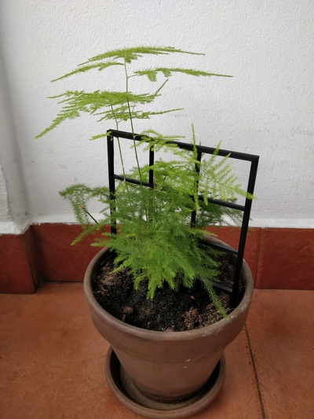

# Vine lattice

This is a lattice or scaffold for climbing plants. It has two support spikes to
fix it to the ground. Size of each part can be adjusted depending on the plant
size.

## Files

* [vine_lattice.scad](vine_lattice.scad): Source code file for OpenSCAD.
* [vine_lattice.stl](vine_lattice.stl): STL with default parameters.
* [vine_lattice_ai3m.curaprofile](vine_lattice_ai3m.curaprofile): Cura profile used for printing on a Anycubic i3 Mega.
* [vine_lattice.jpg](vine_lattice.jpg): End result with default parameters.

## Notes

* Current version is a **single piece**, so total size is severely limited by the build volume of the 3D printer. The default provided STL is about the maximum vertical size that can be printed with a Anycubic i3 Mega.
* Cura profile is not well optimized. It is just default medium profile plus a small brim. I had some adhesion problems on the first layer, but the end result was decent anyway.
* Next version might have spikes rotated to one side to avoid large vertical steps on low resolution prints.
